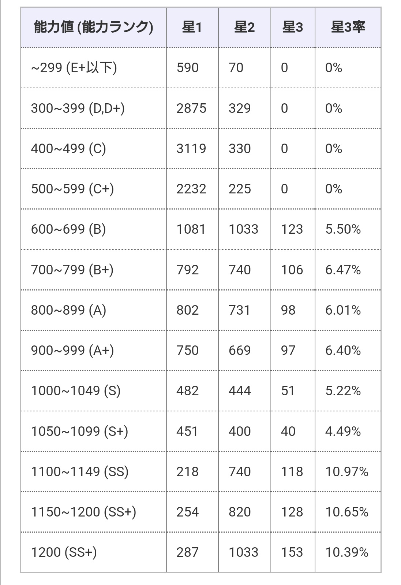
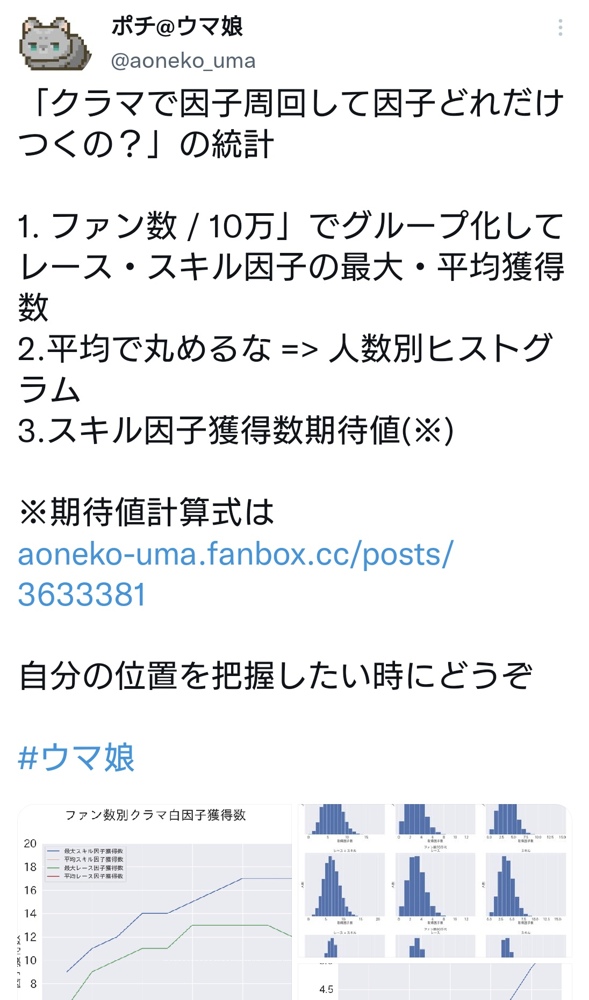

# 因子周回についてのメモ

基本的な1次ソースは以下の通り  
[【中間まとめ】育成における因子継承内容まとめ](https://aoneko-uma.fanbox.cc/posts/4359075)

## 育成ランク

育成ランクSS〜

## ステータス

ポイント
- 〜1099で★3率は5%弱
- 1100〜で★3率は10%強

ソースは[青因子確率分析](https://umamusustation.com/blue_factor_analysis.html)より

## ファン数

以下のポチさんのツイートを参照。  
ファン数自体に因子との相関はなし。

[ファン数別、白因子獲得数](https://twitter.com/aoneko_uma/status/1598565886436089856?t=O_9QG0j_Q_anF9MljgrIIw&s=19)

## 継承率

1次ソースは以下から  
[【因子再抽選実装前】育成における因子継承内容まとめ](https://aoneko-uma.fanbox.cc/posts/3633381)

### スキル因子

ポイントは以下
1. 取得したスキルのレア度が高いと継承率が高くなる。
2. 親祖が同じ因子を持っていると継承率が高くなる。
  

| 親祖スキル 所持人数  | 白 スキル  | ◎ スキル  | 金 スキル  |
|--------|--------|--------|--------|
| 0 | 20.0  | 25.0  | 40.0  | 
| 1 | 22.0  | 27.5  | 44.0  | 
| 2 | 24.2  | 30.3  | 48.4  | 
| 3 | 26.6  | 33.3  | 53.2  | 
| 4 | 29.3  | 36.6  | 58.6  | 
| 5 | 32.2  | 40.3  | 64.4  | 
| 6 | 35.4  | 44.3  | 70.9  | 
※数値はパーセンテージ

### シナリオ因子

親祖が同じ因子を持っていると継承率が上がる。  
確率はスキル因子と同じ。
